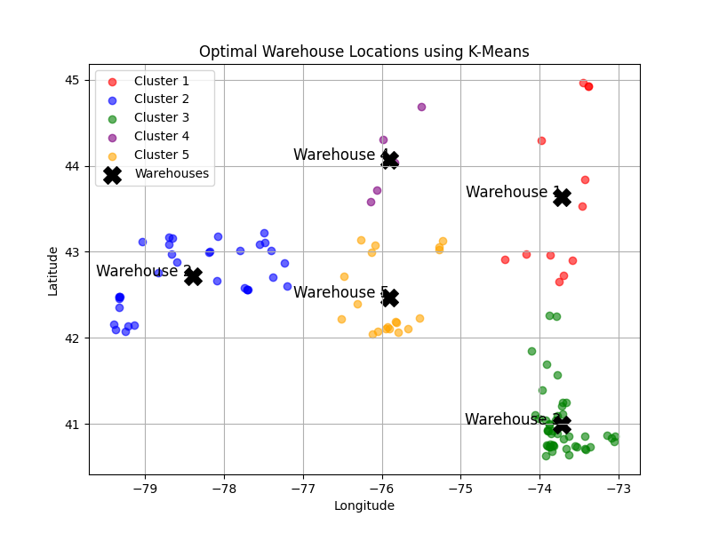

# Customer-Segmentation
This project performs customer segmentation using K-Means clustering to analyze and group customers based on key features. The goal is to identify distinct customer segments that can be used for targeted marketing strategies and business decisions.
Technologies Used
Technologies Used
Python
Libraries: Pandas, NumPy, Matplotlib, Seaborn, Scikit-learn
Jupyter Notebook
Project Overview
In this project, customer data is analyzed to uncover meaningful patterns and groupings. The K-Means clustering algorithm is used to segment customers based on various features, such as spending habits, demographics, and behavior. This segmentation helps businesses identify different customer groups to optimize marketing efforts and improve customer targeting.

Key Steps
Data Collection: The dataset contains information about customers and their purchase behavior.
Data Preprocessing: Cleaning and wrangling the data, handling missing values, and scaling numerical features.
Modeling: Implementing the K-Means clustering algorithm to group customers into segments.
Visualization: Visualizing the clusters using scatter plots and other techniques to understand the segments.
Evaluation: Evaluating the clustering results and interpreting the meaningful characteristics of each segment.

Data Source
The dataset used in this project is based on customer purchase data https://help.qlik.com/en-US/cloud-services/Subsystems/Hub/Content/Resources/Examples/Kmeans/DistributorData.csv.
Results
The K-Means clustering algorithm groups customers into K segments , where each segment shares similar behaviors or characteristics.
Visualizations show how the segments are distributed in multi-dimensional feature space.
Contributing
Feel free to fork the repository, create an issue, or submit a pull request. Contributions are welcome!

